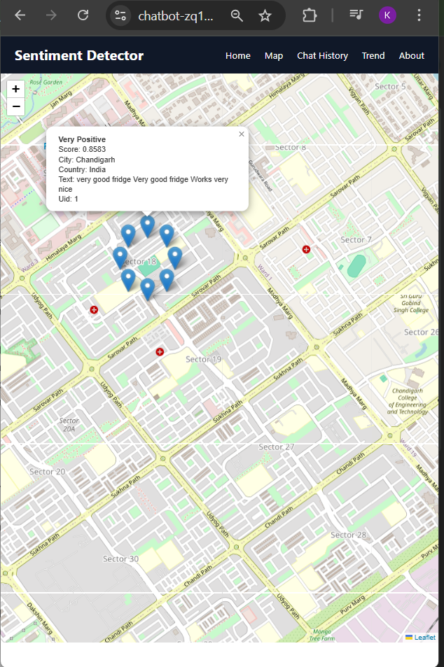

# Sentiment Analysis Web App

The app allows users to:

✅ Register and receive a session token
✅ Submit text for sentiment analysis
✅ Track location of requests via IP
✅ Save/query sentiment history
✅ View time-based sentiment trends
✅ Plot a global map of sentiment data
✅ Delete items from history
✅ View details such as confidence and sentiment breakdown

# Features
## 🔐 User System

Lightweight registration using a session token.

IP address stored at registration.

## 📝 Sentiment Analysis (VADER)

1. Cleans noisy input
- Removes URLs

- Normalizes punctuation

- Reduces stretched words (“soooo” → “soo”)


2. Classifies sentiment using enhanced thresholds:

    1. Very Positive

    2. Positive

    3. Neutral

    4. Negative

    5. Very Negative

3. Returns compound score + confidence score.

4. Saves detailed VADER scores (JSON).
- Compound score

- Confidence score (abs(compound))

- Raw VADER breakdown (JSON)

## 🌍 IP → Location Lookup

Uses ip-api.com to fetch:

- Country

- City

- Latitude & Longitude

- Postal code

- Stored with each query.

## 📊 Sentiment Trend Graph

- Plots sentiment score over time.

- Points colored by country – city using Matplotlib.

- Returned as PNG via FastAPI StreamingResponse.

## 🗺️ Sentiment Map API

- Returns all queries as JSON with lat/lng.

- Then is is displayed using Leaflet.js on frontend.

## 🧾 History Page

- Shows all past user queries.

- Allows deleting items.

# Tech Stack

## Backend

- FastAPI

- SQLAlchemy ORM
 
- SQLite (DB)

- Requests (IP lookup)

- Matplotlib

- VADER Sentiment (NLTK)

## Frontend

- Jinja2 Templates

- HTML + CSS + JS

- Leaflet.js for maps

- Session token stored in localStorage

# Installation

1. Clone the repository

git clone <repo-url>
cd <project-folder>

2. Create virtual environment
python -m venv .venv

Linux
- source .venv/bin/activate      
Windows
- .\.venv\Scripts\activate


3. Install dependencies

pip install -r requirements.txt

4. Download VADER model 
*(Not required manually — app downloads automatically, but available if needed)*

```python
import nltk
nltk.download("vader_lexicon")
```

5. Run the app

``` python CLI
uvicorn main:app --reload
```

6. Visit

``` Text
http://127.0.0.1:8000/

```

# API Endpoints Overview

## Auth

| Method | Endpoint    | Description                       |
|:------ |:----------- |:--------------------------------- |
| GET    | `/register` | Show registration form            |
| POST   | `/register` | Create user, return session token |

## Sentiment

| Method | Endpoint          | Description              |
|:------ |: -----------------|:------------------------ |
| POST   | `/sentiment`      | Analyze sentiment & save |
| GET    | `/sentiment-form` | Text input form          |

## History

| Method | Endpoint                       | Description       |
|:------ |:------------------------------ |:----------------- |
| GET    | `/history?token=XYZ`           | View user history |
| DELETE | `/delete-query/{id}?token=XYZ` | Delete query      |


## Trend Graph

- Plots sentiment scores over time

- Color-coded by (Country – City)

- Built with Matplotlib

- Returned as a PNG through FastAPI StreamingResponse

| Method | Endpoint           | Returns   |
|:------ |:------------------ |:--------- |
| GET    | `/trend?token=XYZ` | PNG image |


## Map

| Method | Endpoint         | Returns                        |
|:------ |:---------------- |:------------------------------ |
| GET    | `/sentiment-map` | JSON location + sentiment data |
| GET    | `/map`           | Web map page                   |




# Database Schema (Simplified)

## User

| Field         | Type     |
|:------------- |:-------- |
| id            | Integer  |
| username      | String   |
| session_token | String   |
| ip_address    | String   |
| created_at    | DateTime |

## Query

| Field                | Type     |
|:-------------------- |:-------- |
| id                   | Integer  |
| text                 | String   |
| sentiment            | String   |
| score                | Float    |
| details              | JSON     |
| time                 | DateTime |
| latitude / longitude | Float    |
| city                 | String   |
| country              | String   |
| confidence           | Float    |
| user_id              | FK(User) |


# How Sentiment Is Calculated  (VADER + Custom Normalization)

## Overview

The pipeline processes raw user text and produces:

- Cleaned text  
- Sentiment label  
- Compound sentiment score  
- Confidence score  
- VADER’s full sentiment breakdown  

## The algorithm improves over plain VADER by normalizing noisy input and using more realistic thresholds.

## 1. Input Text
Raw text is received from the user.

Example:

``` Text
"I looooove this sooo much!!! Check this out: https://xyz.com
"
```

## 2. Remove URLs
``` Python
re.sub(r"http\S+|www\S+", "", text)

```
## 3. Reduce excessive punctuation
Repeated punctuation like "!!!" boosts sentiment artificially.
If punctuation repeats 3+ times, reduce to 2.

``` Python
re.sub(r"([!?.,])\1{2,}", r"\1\1", text)
```
## 4. Normalize stretched words (“elongations”)
``` Python
re.sub(r"(.)\1{2,}", r"\1\1", text)
```

## 5. VADER Sentiment Scoring

``` Python
sia.polarity_scores(cleaned_text)
```
VADER returns:
``` JSON
{
  "neg": 0.12,
  "neu": 0.73,
  "pos": 0.15,
  "compound": 0.3182
}
```

Compound score
- Main metric for overall sentiment
- Range: -1 to +1


## 6. Sentiment Classification (Custom Thresholds)

To improve real-world accuracy, the system uses softer thresholds than default VADER:

| Compound Score Range | Output Label  |
|:-------------------- |:------------- |
| ≥ 0.70               | Very Positive |
| ≥ 0.25               | Positive      |
| -0.25 to 0.25        | Neutral       |
| ≤ -0.25 and > -0.70  | Negative      |
| ≤ -0.70              | Very Negative |

## 7. Confidence Score
```Python
confidence = abs(compound)
```
Ranges: 
| Confidence | Interpretation    |
|:---------- |:----------------- |
| 0.00–0.20  | Low confidence    |
| 0.20–0.50  | Medium confidence |
| 0.50–1.00  | High confidence   |

## 8. Final Output Structure

``` JSON
{
  "text": "<original input>",
  "cleaned_text": "<normalized input>",
  "sentiment": "<sentiment label>",
  "score": <compound score>,
  "confidence": <abs(compound)>,
  "details": {
    "neg": ...,
    "neu": ...,
    "pos": ...,
    "compound": ...
  }
}
```


## 8. Algorithm

INPUT raw_text

```Python
1. Clean Text:
    - strip whitespace
    - remove URLs
    - reduce repeated punctuation
    - reduce stretched characters

2. Score Text with VADER:
    - raw_scores = VADER(cleaned_text)
    - compound = raw_scores["compound"]

3. Classify Sentiment:
    if compound ≥ 0.70:
         sentiment = "Very Positive"
    elif compound ≥ 0.25:
         sentiment = "Positive"
    elif -0.25 < compound < 0.25:
         sentiment = "Neutral"
    elif compound ≤ -0.25 and compound > -0.70:
         sentiment = "Negative"
    else:
         sentiment = "Very Negative"

4. Compute Confidence:
    confidence = abs(compound)

5. Return:
    text, cleaned_text, sentiment, score, confidence, details
```